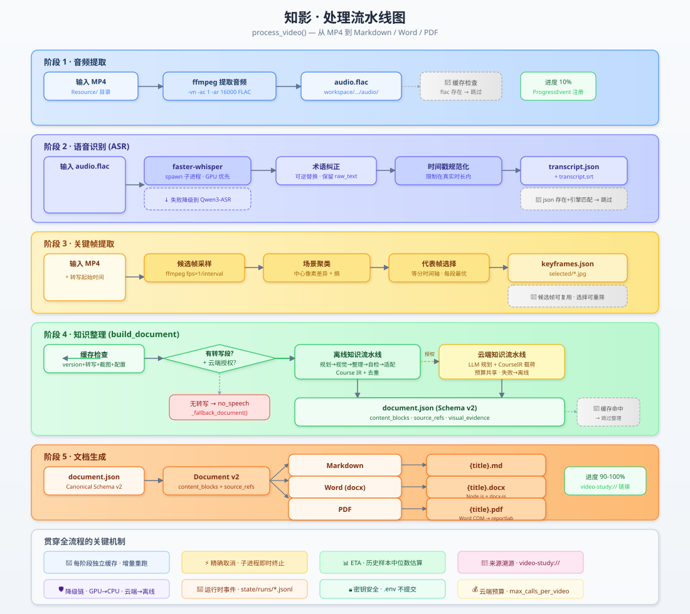
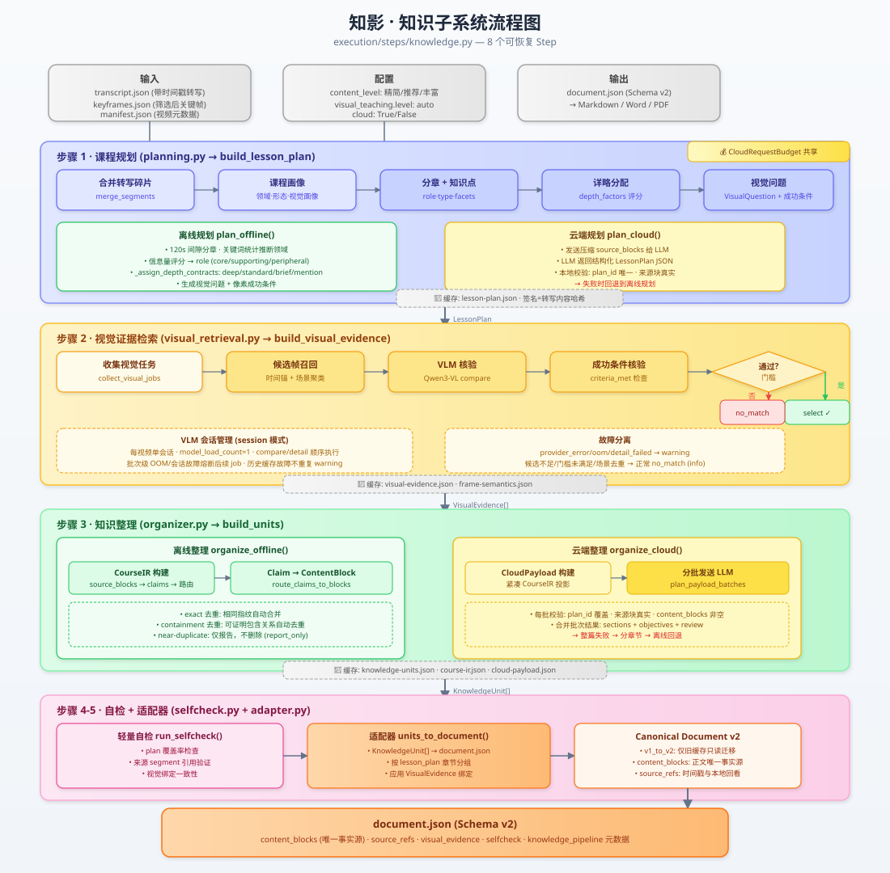

# 知影开发指南

> 当前架构：V6.1 · 产品版本：1.0.0

这是一份上手和排障指南，不是机器合同。开始修改前，先读取 [`项目索引`](../项目索引.md) 和 [`AI 执行入口`](../AI执行入口.md)；模块、节点和错误归属以 `docs/architecture/*.yaml`、`docs/diagnostics/problem-index.yaml` 和测试为准。

## 开始前的五分钟

1. 确认当前任务和授权边界；
2. 查看工作树，保留已有修改；
3. 如果涉及具体视频，先诊断已有 Workspace；
4. 根据 `step_id/error_code` 找 owner 和测试；
5. 先写失败回归测试，再改最小责任模块。

真实云请求、模型下载或变更、依赖重装、长视频重跑和便携构建都需要单独授权。不得为了“测试配置”直接发起真实云请求。

## 最常用命令

### 诊断一个已有工作区

```powershell
.venv\Scripts\python.exe scripts\diagnostics\diagnose_workspace.py workspace\<video_id>
```

诊断输出中的 `step_id` 和 `error_code` 应在 [`problem-index.yaml`](../diagnostics/problem-index.yaml) 中查找。不要先清缓存，也不要先重跑长视频。

### 运行离线验收

```powershell
conda activate ImageT10
python -m unittest discover -s tests
python -m compileall -q src tests
python -m pip check
git diff --check
```

小改动先运行责任模块的定向测试，交付前再运行完整离线验收。全链路测试必须对齐桌面 UI 实际挂载的路径。

## 先建立这张心智图


用户操作先进入桌面层，再由应用层创建处理请求。`GraphRuntime` 是唯一生产编排器；每个会产生副作用的节点由 `NodeExecutor` 执行并提交 Artifact。知识与编辑层只处理领域内容，外部模型和工具通过 Port 接入。

```text
Desktop → Application → GraphRuntime → NodeExecutor → ArtifactStore
                                  ↓
                   Knowledge + Editorial + Render
                                  ↓
                    Markdown + Word + PDF
```

`pipeline.py` 只保留兼容门面，不得恢复为第二套编排器。

## 代码地图

| 目录或文件 | 负责什么 | 常见改动 |
|---|---|---|
| `src/zhiying/desktop/` | Tk 界面、队列和桌面状态 | 按钮、提示、队列展示 |
| `src/zhiying/application/` | 桌面与执行内核之间的用例边界 | 请求 DTO、处理服务 |
| `src/zhiying/execution/` | Graph、节点事务、缓存、Artifact、事件和 Port | 编排、恢复、资源与状态 |
| `src/zhiying/execution/graphs/` | Source/Job/Video/Aggregate Graph 拓扑 | 节点顺序、条件路由 |
| `src/zhiying/execution/steps/` | 23 个生产节点的实现 | 单步骤行为 |
| `src/zhiying/knowledge/` | 课程规划、视觉证据、CourseIR、知识单元 | 内容理解与整理 |
| `src/zhiying/editorial/` | 策略、蓝图、章节写作、质量审计与修订 | 统一内容结构及其质量 |
| `src/zhiying/render_v31.py` | Markdown 与 v3.1 渲染入口 | 文档输出语义 |
| `scripts/renderers/` | Word 等外部渲染脚本 | DOCX 组件和公式 |
| `src/zhiying/source.py` | 视频链接预检、下载与校验 | 链接源错误处理 |
| `src/zhiying/providers.py` | 云端模型适配 | 模型调用与回退 |
| `src/zhiying/asr.py` | 语音识别适配 | ASR 引擎链 |
| `src/zhiying/frames.py` | 候选帧和代表帧选择 | 图像采样策略 |
| `src/zhiying/localplay.py` | 本地回看协议 | `video-study://` |

需要精确 owner、Artifact、节点和测试时，不要从这张表猜，查：

- [`module-boundaries.yaml`](../architecture/module-boundaries.yaml)：模块边界与 owner；
- [`pipeline-steps.yaml`](../architecture/pipeline-steps.yaml)：生产节点目录；
- [`source-layout.yaml`](../architecture/source-layout.yaml)：源码与数据目录职责；
- [`problem-index.yaml`](../diagnostics/problem-index.yaml)：错误归属和安全重跑起点。

## 一段视频怎样被处理



生产流程由 SourceGraph、VideoGraph、可选 AggregateGraph 和 Job 终态组成。对开发者最重要的不是背下节点名，而是理解三个规则：

1. Graph 决定“下一步做什么”；
2. NodeExecutor 决定“一步怎样安全执行并提交”；
3. Artifact 和 Cache 决定“什么结果可以恢复和复用”。

节点的当前精确清单见 [`pipeline-steps.yaml`](../architecture/pipeline-steps.yaml)。

## NodeExecutor 的事务顺序

```text
检查取消
→ 解析并校验输入 Artifact
→ 计算指纹并判断缓存
→ 获取工作区和资源租约
→ 在 staging 中执行
→ 校验输出合同
→ 原子提交 Artifact
→ 写 CacheRecord 和终态事件
→ 返回 State 增量
→ LangGraph 写入下一 Checkpoint
```

开发节点时必须保持：

- 缓存判断前不初始化 ASR、VLM、云客户端或 Word 等昂贵能力；
- 节点只能写自己的 staging 和声明的输出；
- Artifact 先提交，CacheRecord 后记录；
- 重放不能重复产生云成本或覆盖有效产物；
- State 和 Checkpoint 只保存小型可序列化数据与 Artifact 引用。

API Key、模型实例、二进制媒体、完整 transcript、完整 Document 和无界响应都不能进入 State/Checkpoint。

## 知识与编辑链



知识层先把转写和视觉证据整理成 CourseIR 与知识单元。编辑层再根据用户偏好生成蓝图和章节，把正文、公式、图片与来源装配成统一内容结构，并在渲染前后执行质量检查。

本地模式走完整的确定性链；云端模式可以让模型在受控工具内查询证据、提交蓝图或章节、进行局部修订。能力降级固定为：

```text
tool_native → structured_only → local_deterministic
```

无论走哪条路，都必须得到结构合法、来源可追踪的内容树，并记录真实 provenance 和降级原因。

## 内容结构与渲染

编辑层不会分别编写三套文档，而是先生成一棵组件树。标题、段落、列表、公式、表格、图片、提示框、分页和来源链接都在这里表达；质量检查借此定位具体组件，三个渲染器也据此保持内容一致。当前代码把这份内部合同命名为 `Document v3.1`。

三个 Renderer 直接消费同一组件树：

- Markdown：便于查看和二次加工；
- Word：支持原生 OMML 公式；
- PDF：优先由 Word 转换，也可走本地渲染路径。

生产链不得重新引入 `v3 → v2` 降级，也不得由 Renderer 自动注入固定的“学习目标”“课程复习”等旧模板栏目。历史 v2/v3 只读兼容。

## Workspace 与恢复

每个视频的工作区位于 `workspace/<video_id>/`。常见内容：

```text
manifest.json                 视频与来源元数据
audio/                        提取音频
transcript/                   原始与规范化转写
images/                       候选帧、关键帧与索引
knowledge/                    规划、CourseIR、证据、蓝图、章节和质量报告
state/cache/                  跨 Job 缓存记录
state/runs/                   运行事件
state/previews/               页面审计数据
```

Checkpoint 用于同一 Job 的运行恢复，WorkspaceCache 用于跨 Job 的计算复用；二者不能互相代替。新 Graph 版本不迁移旧 Checkpoint，但可以验证并复用兼容 Artifact。

## 常见问题的排查顺序

### 文档内容不对

1. 先看 transcript 与来源时间是否正确；
2. 再看 evidence corrections、CourseIR、knowledge units；
3. 检查 editorial policy、blueprint、chapters 和 quality report；
4. 最后判断是内容事实错误，还是 Renderer 展示错误。

不要直接改最终 Markdown/Word/PDF 来掩盖上游问题。

### 图片缺失或配错

依次检查候选帧、视觉任务、视觉证据、Document 中的 image 组件和三端渲染。图片应来自证据绑定，不应由模板随意插入。

### 任务重复执行或无法恢复

检查输入 Artifact、指纹、版本字段、CacheRecord、提交顺序和 Checkpoint。不要用并发重跑同一目录来掩盖写入竞争。

### 云端没有被调用

先确认用户是否授权，再检查能力注册、预算和降级记录。未授权时 CloudPort 构造和请求都应为 0，这通常是正确行为。

## 测试策略

| 层级 | 作用 | 默认联网 |
|---|---|---|
| 离线单元 | 纯函数、合同、fake Port | 否 |
| 离线集成 | fixture 到 Graph/文档结果 | 否 |
| 在线冒烟 | 验证真实站点或云端能力 | 是，需单独授权 |
| UI 等价链路 | 验证桌面实际挂载的完整路径 | 视任务而定 |

回归测试应复现用户看到的问题，并尽量锁定最小责任模块。不要只写一个绕开 UI 或绕开生产 Graph 的“理论通过”测试。

## 不可突破的边界

- 仅 Windows 桌面与兼容 CLI，不增加 Web UI、HTTP 服务、监听端口或 `serve`；
- LangGraph 是唯一生产编排器；
- 保持 JSON → Markdown → Word → PDF 和时间戳可追溯；
- 一段视频只建立一个 VLM 会话；
- 未授权不得构造或调用云端能力；
- 文本授权不包含图片上传授权；
- Function Calling 不得获得任意文件、Shell、网络、MCP 或无限循环权限；
- 保留无需 LLM 的本地确定性完成路径；
- 降级产物可以输出，但必须诚实记录 `degraded`、模型链和原因；
- 不读取、打印或提交 `.env`；
- 不主动删除历史 Workspace，不重置用户的 dirty worktree。

## 提交前检查

- [ ] 问题能由新增或已有回归测试复现；
- [ ] 修改位于机器合同指定的 owner；
- [ ] 没有新增第二编排路径或跨层依赖；
- [ ] 缓存、取消、恢复和降级语义未被破坏；
- [ ] 未发起未授权的云请求、下载或长视频重跑；
- [ ] 定向测试通过；
- [ ] 完整离线验收通过；
- [ ] `git diff --check` 通过；
- [ ] 文档和机器合同在需要时已同步。

## 继续阅读

- [架构详解](架构详解.md)：设计理由和全链路细节；
- [软件介绍](软件介绍.md)：从用户视角理解实际操作；
- [业务文档](业务文档.md)：理解产品边界与成功标准；
- [项目文档导航](README.md)：返回文档入口。
