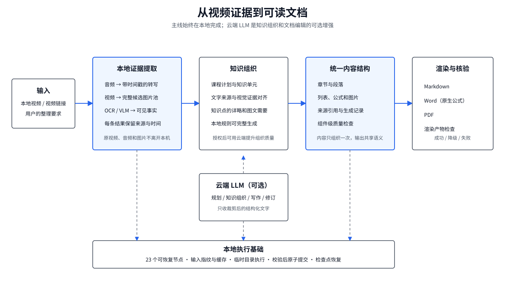
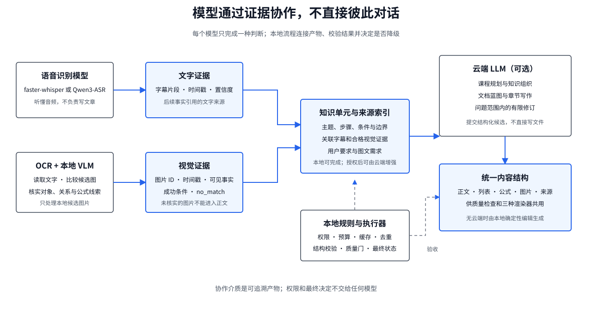
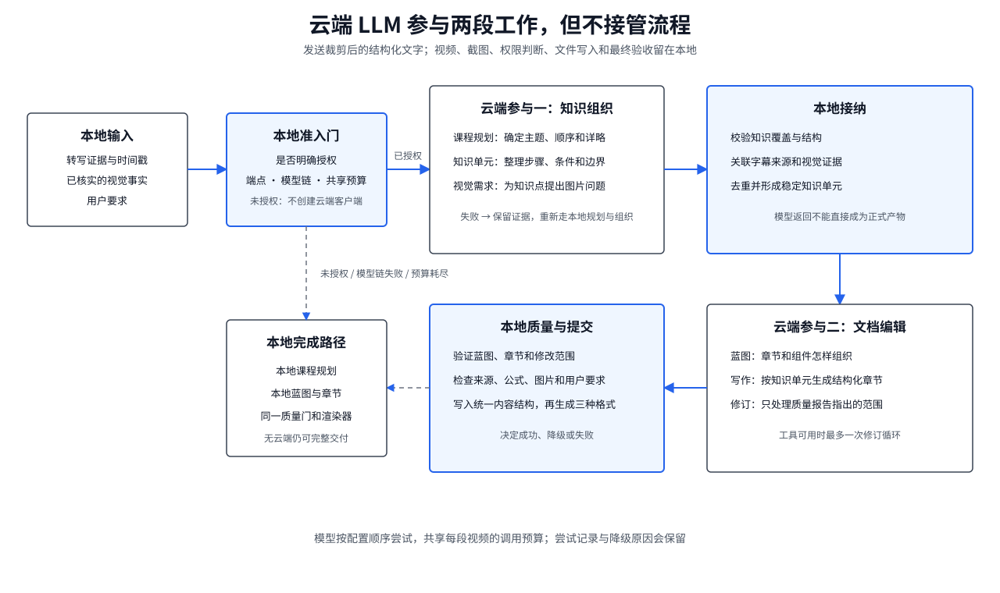
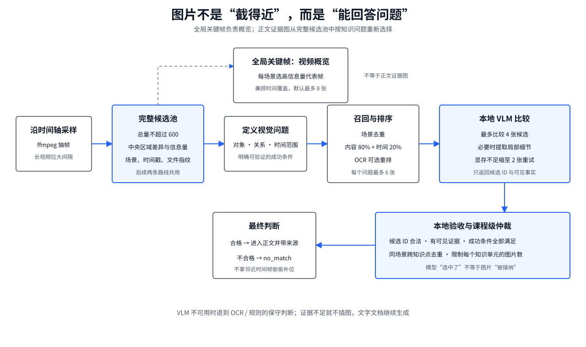
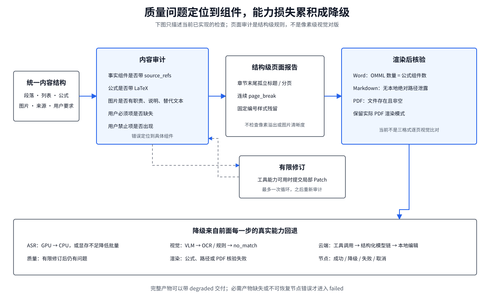

# 知影架构详解

> 当前架构：V6.1 · 产品版本：1.0.0

知影是一套把教学视频整理成可读文档的 Windows 桌面应用。它不是把字幕换一种格式，而是先从视频中取得可追溯的文字和画面证据，再围绕知识结构组织内容，最后生成 Markdown、Word 和 PDF。

这套架构最重要的特点，是把“模型擅长的理解与表达”和“程序必须负责的确定性控制”分开。语音模型负责听，本地视觉模型负责看，云端 LLM 在获得授权后负责规划和写作；权限、预算、缓存、证据校验、文件提交和降级决定始终留在本地程序中。

## 视频怎样变成文档

用户可以添加本地视频，也可以提供视频链接。链接会先经过下载、缓存和媒体校验，之后与本地视频进入同一条处理链。系统探测媒体信息、提取音频并生成带时间戳的转写，同时沿视频时间轴建立候选图片池。

转写不是最终正文。系统先根据用户选择的详略程度、图文偏好和自然语言要求，形成课程结构与知识单元。每个知识单元保留所依据的字幕片段、时间范围和视觉证据，因此后续写作不是脱离原视频自由发挥。

整理后的正文并不直接写死为 Markdown 或 Word，而是先保存成带类型的内容结构。段落、列表、公式、图片和来源各有明确字段；正文事实带来源引用，图片带职责、说明和替代文本。这个中间层把内容生成、质量检查和三种输出连接起来：内容只组织一次，检查可以定位到具体组件，三个渲染器也能保持同一份语义。

整条生产链由 23 个可恢复节点组成。从媒体探测、语音识别、候选帧、视觉证据、知识整理，到文档蓝图、正文组装、三种格式渲染和最终核验，每一步都有明确输入与产物。流程图负责决定下一步做什么；节点执行器负责缓存判断、临时目录执行、结果校验和原子提交，避免中断后把半成品当成有效文件。

## 各个模型怎样协作

模型之间没有直接对话。它们通过带来源的中间产物协作：上游模型产生证据，下游模型只读取完成校验的结果，本地流程负责连接和约束它们。

| 能力 | 负责什么 | 产出怎样被后续使用 |
|---|---|---|
| 语音识别模型 | 把音频转成带时间戳的字幕片段 | 为知识单元、正文事实和回看链接提供文字来源 |
| OCR | 读取画面中的标题、板书和界面文字 | 帮助候选图排序，并为视觉判断提供可见文字 |
| 本地 VLM | 比较少量候选图，核实对象、关系和公式线索 | 形成视觉事实；只有满足成功条件的图片才能进入正文 |
| 云端 LLM | 在授权后参与课程规划、知识组织、文档蓝图、章节写作和有限修订 | 提交结构化结果，不能直接改正式文件 |
| 本地规则 | 管理权限、预算、缓存、证据约束、去重、质量门和降级 | 决定模型结果能否被接纳，以及任务最终状态 |

语音识别引擎由用户配置，当前可选 faster-whisper 或 Qwen3-ASR，它们不是自动串联的两级模型。faster-whisper 在 GPU 路径失败时可以回退 CPU；Qwen3-ASR 遇到显存不足时会缩小批量。两种引擎都在隔离进程中运行，避免模型运行时拖垮桌面主进程。

本地视觉模型采用“一段视频一个短生命周期会话”。模型只加载一次，在同一会话中完成候选图比较和必要的细节提取；会话异常时允许重建一次。当前视觉适配器需要 CUDA，运行环境或本地权重不满足条件时不会现场下载模型，而是退回更保守的 OCR/规则路径。

云端侧配置的是有顺序的模型链。一个模型请求失败后，结构化请求可以在共享预算内尝试下一个模型；这些模型不是并行投票，也不会彼此传话。每次尝试都会记录所用模型、调用次数和结果，预算耗尽后转入本地完成路径。

## 云端 LLM 在哪里参与

云端 LLM 是可选的内容能力，不是流水线的控制中心。只有用户明确授权本次发送的数据、服务端点、模型链和预算后，系统才会创建云端客户端；未授权时不会发起请求，也不会为了测试配置而调用云端。

它在两处参与工作。

第一处是知识整理。系统把经过裁剪的转写证据和用户要求交给 LLM，用于生成课程计划和组织知识单元。云端规划失败时可以改用本地规划；云端知识组织没有完成时，系统保留已有证据，重新走本地组织，并把这次任务标记为能力降级。

第二处是文档编辑。LLM 根据知识单元、代表证据、已核实的视觉事实和渲染能力提交文档蓝图；蓝图通过本地校验后，再按结构生成章节。正文完成后，本地质量审计先指出具体组件的问题。工具调用能力可用且修订额度未耗尽时，LLM 可以查询问题范围内的证据并提交一次受限修改，修改仍要重新校验。

云端模型收到的是为当前任务裁剪的结构化文字，而不是整段视频。视觉工具返回本地已经核实的对象、文字、关系和公式线索，不发送图片二进制。规划只需要课程轮廓与代表证据，章节写作只取得当前章节的知识单元，修订只取得失败组件及邻近内容，避免每次重复发送完整转写和全部中间结果。

工具调用受到明确边界约束。模型可以查询有限的文字证据、视觉事实和渲染能力，也可以提交蓝图或局部修改；它不能读取任意文件、运行命令、访问额外网络、上传图片或直接覆盖正式产物。所有提交先进入候选区，由本地代码验证结构、引用和修改范围。

云端编辑有三种能力形态。支持原生工具调用的模型可以按需查询证据并进行局部修订；只支持结构化输出的模型仍可生成规划、蓝图和章节，但没有主动工具循环；云端不可用时，本地确定性编辑会用同一批证据完成蓝图、章节、组装和输出。这意味着云端提升的是组织与表达能力，而不是决定项目能否完成。

## 文档中的图片怎样选出

知影不会按固定间隔随便插截图，也不会把离字幕时间最近的一帧直接当作证据。系统保留两类图片结果：少量全局关键帧用于概览；面向具体知识点选择的证据图才用于正文说明。

候选池由 ffmpeg 沿时间轴采样。采样间隔会根据视频时长调整，使候选总量不超过配置上限 600。系统关注画面中央的教学区域，以像素差异识别场景变化，并计算画面信息量。每个场景先产生代表帧；全局关键帧再兼顾时间覆盖和最小间隔，默认最多保留 8 张，避免高信息量画面全部挤在视频开头。

正文选图从完整候选池重新开始，而不是只在这 8 张全局关键帧中挑选。课程规划先为确实需要画面的知识点提出视觉问题和成功条件，例如“画面是否同时出现积分上下限、积分号和被积函数”。视觉需要分为不需要、辅助说明和必须提供；不需要图片的知识点不会创建视觉任务。

召回阶段先按场景整理候选，再综合画面内容和较弱的时间先验，为每个问题保留最多 6 张候选。当前召回分数以内容质量为主，时间位置为辅。OCR 可用时，会根据问题中的文字、对象和场景类型重新排序；本地 VLM 随后最多比较 4 张候选，判断哪张真正回答了问题。显存不足时会缩小为 2 张重试一次。

模型选中图片后还要过本地验收。返回的图片必须属于允许的候选集合，画面中必须存在可见证据，问题定义的成功条件必须满足，图片和知识点也要保持来源关联。课程级仲裁还会去掉同一场景在多个知识点中的重复使用，并限制每个知识单元的图片数量。

找不到合格图片时，结果就是 `no_match`。这不是异常，而是明确的质量结论。系统不会用邻近时间帧静默补位；缺少视觉证据时继续生成文字文档，并在需要的地方记录视觉能力不足。

## 质量检查和降级怎样形成

质量不是由另一个模型给一个笼统分数。当前实现以本地、可重复的规则检查内容结构和渲染产物，并把问题落到具体组件和错误码上。

内容审计检查三类硬条件：事实段落、列表、公式、表格和提示框是否带来源；公式组件是否带 LaTeX；图片是否具有职责、说明和替代文本。用户明确要求的内容缺失，或者明确禁止的内容出现，也会成为错误。页面报告目前是结构级检查，主要发现章节末尾孤立标题、连续分页和固定编号残留；它不是截图或像素级版面识别，不能据此声称已经检查文字溢出或图片清晰度。

渲染完成后，系统继续核对 Word 原生公式数量是否与公式组件一致，Markdown 是否泄露本地绝对路径，PDF 是否存在且非空。三种格式都读取同一份结构化内容，因此不会各自重新生成事实，但当前核验也不等同于完整的视觉对版。

降级原因来自具体能力缺失，而不是最后临时贴上的标签。主要路线如下：

- 云端未授权时直接使用本地路径；这是用户选择的运行方式，不等同于故障。
- 原生工具调用不可用时退到结构化云端输出；结构化模型会按配置顺序和共享预算尝试。
- 云端规划或知识组织失败时回到本地规则；云端编辑失败时保留本地蓝图和章节，并记录模型尝试与原因。
- 视觉模型不可用、显存重试仍失败或证据条件不满足时，退到 OCR/规则判断，最终可以不插图。
- faster-whisper 的 GPU 路径失败时可回退 CPU；Qwen3-ASR 显存不足时降低批量。
- 内容审计不通过且工具修订能力可用时，最多进行一次受限修订；额度耗尽或仍未通过时，以降级状态结束，而不是掩盖问题。
- 渲染核验发现公式数量不一致、路径泄露或 PDF 缺失时，渲染验证节点标记降级并保留诊断信息。

每个节点都可以报告成功、降级、失败或取消。任务最终状态取整条链上最严重的结果：完整文档可以在部分能力缺失时以 `degraded` 交付；必需产物缺失或节点发生不可恢复错误时才是 `failed`。界面和运行记录会保留降级原因、实际模型链、调用用量和产物来源，方便判断“文档是否可用”以及“哪些能力没有生效”。

## 执行为什么能够恢复

每个节点开始前都会检查取消状态和输入，计算输入指纹并查询缓存。只有缓存未命中时，才加载语音模型、视觉模型、Word 或云端能力。节点先在自己的临时目录中执行，输出通过校验后再原子提交为正式产物，最后写缓存记录和流程检查点。

缓存回答“这组输入是否已经算过”，检查点回答“这次任务运行到哪里”，两者分开保存。流程状态只保留小型状态和产物引用，不把模型实例、图片二进制和完整文档塞进调度状态。程序意外退出后可以从已提交节点继续；未完成的临时结果会被清理，不会污染后续运行。

这套机制也保证了降级可追踪。一次能力回退会附着在对应节点的结果上，并继续传递到任务终态，而不是等全部完成后仅显示一条模糊的“生成成功”。

## 这套架构解决了什么

知影的核心不是某一个大模型，而是证据、模型和执行边界的组合：原视频始终是事实起点；不同模型各做自己擅长的工作；云端能力可以增强但不能接管系统；图片必须回答明确问题；每条事实和每次降级都能回溯；同一份内容结构稳定生成三种文档。

这种设计牺牲了“一次提示词直接写完”的表面简单，换来的是更可控的事实来源、更诚实的图片选择、更清楚的能力降级，以及中断后可恢复的桌面执行过程。

精确的节点名称、模块边界和诊断码以 [`pipeline-steps.yaml`](../architecture/pipeline-steps.yaml)、[`module-boundaries.yaml`](../architecture/module-boundaries.yaml) 和 [`problem-index.yaml`](../diagnostics/problem-index.yaml) 为准。代码定位与测试入口见[开发文档](开发文档.md)，产品价值与使用边界见[业务文档](业务文档.md)。
