# 知影使用说明

> **适用版本**：V6.1 / 1.0.0 · **平台**：Windows 10/11 x64 桌面端
>
> 把本地教学视频或公开视频链接整理成**带来源时间戳**的 Markdown、Word 和 PDF。文档中的"回看来源"链接可直接跳回原视频对应位置。

如果你只想尽快用起来，阅读[第一次使用](#第一次使用)即可。

---

## 你会得到什么

一次整理通常会生成：

- **Markdown**：便于版本比较、知识库导入和二次处理；
- **Word**：适合编辑、打印，支持原生 OMML 公式；
- **PDF**：适合阅读、分享和归档；
- **回看来源**：每个重要内容对应原视频的时间链接；
- **可复用缓存**：转写、关键帧和知识结构可被后续任务复用。

知影不是简单地把字幕复制进文档。它会结合转写、时间戳和关键画面，组织章节、解释、步骤、案例与来源。

---

## 第一次使用

### 1. 启动

双击项目根目录的 `启动桌面版.cmd`。

开发环境也可从命令行启动：

```bash
conda activate ImageT10
zhiying desktop --config config.yaml
```

启动后进入主界面：

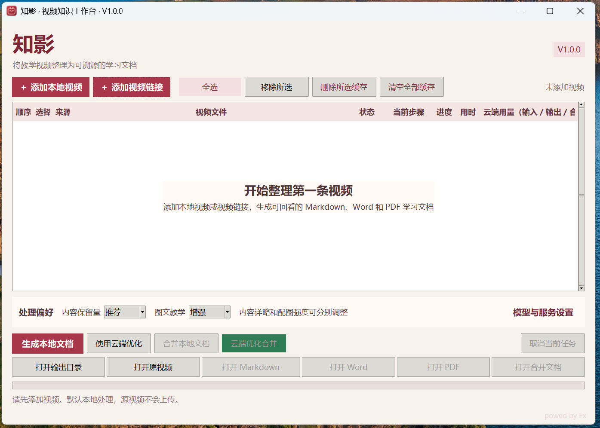

主界面分为 4 个区域：

| 区域 | 作用 |
|---|---|
| 视频列表 | 选择、排序、查看每个任务的状态、当前步骤、进度、用时与云端用量 |
| 添加与管理 | 添加本地文件或视频链接、移除项目、清理缓存 |
| 整理偏好 | 选择内容详略（精简 / 推荐 / 丰富）与图文密度 |
| 执行与结果 | 开始本地/云端整理、合并任务、取消任务、打开产物 |

### 2. 添加视频

可以选择两种方式：

- **本地视频**：点击 `+ 添加本地视频`，选择 MP4 文件；
- **视频链接**：点击 `+ 添加视频链接`，粘贴视频页面链接、直链、HLS 流或 B 站 BV/av 号。

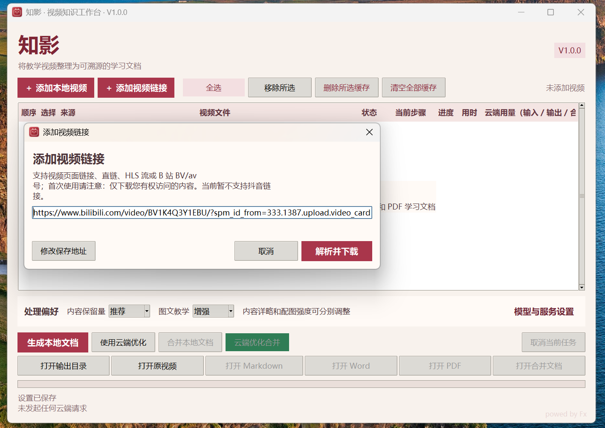

> 支持视频页面链接、直链、HLS 流或 B 站 BV/av 号；首次使用请注意：仅下载您有权访问的内容。当前暂不支持抖音链接。

链接视频会先下载到本地，之后与本地文件走同一条整理流程。下载成功不等于已经完成整理；状态变为"已就绪"后再勾选视频开始生成文档。当前并非所有网站都能稳定解析，遇到失败时以界面诊断为准。

### 3. 模型与服务设置（可选）

点击主界面右下角 `模型与服务设置` 打开对话框：

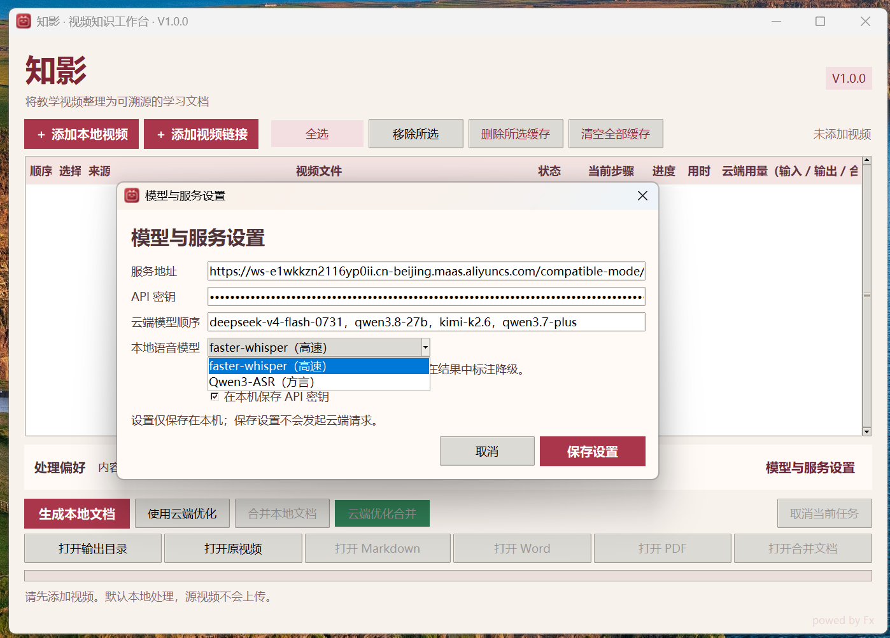

| 字段 | 用途 |
|---|---|
| 服务地址 / API 密钥 | 仅在使用云端优化时需要 |
| 云端模型顺序 | 多个模型按顺序回退；单个失败自动切下一个 |
| 本地语音模型 | `faster-whisper`（高速）或 `Qwen3-ASR`（方言） |
| 在本机保存 API 密钥 | 勾选后写入本机 `.env`；不勾选则每次重新输入 |

设置仅保存在本机，保存时不会发起任何云端请求。

### 4. 选择整理偏好

| 设置 | 选项 | 适合场景 |
|---|---|---|
| 内容保留量 | 精简 / 推荐 / 丰富 | 临考复习 / 日常学习（默认） / 完整讲义 |
| 图文教学 | 图文精简 / 均衡 / 增强 / 自动 | 控制关键画面的使用密度 |

> 内容详略和图片密度互不绑定，可以自由组合。

### 5. 开始执行

勾选 1 个或多个视频后点击 `生成本地文档` 或 `使用云端优化`：

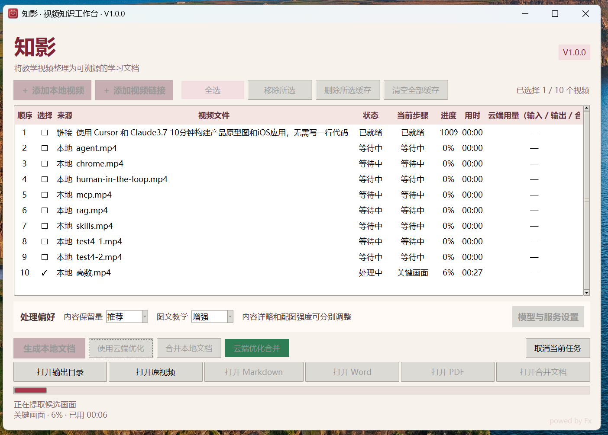

- `生成本地文档`：完全本地处理，不调用云端；
- `使用云端优化`：弹出授权窗口（见下文），每次都需要单独确认。

处理过程中可以看到当前阶段、进度、耗时和预计剩余时间；云端模式还会显示 Token 用量。

#### 云端授权与文档要求

如果选择 `使用云端优化`，会先弹出授权窗口：

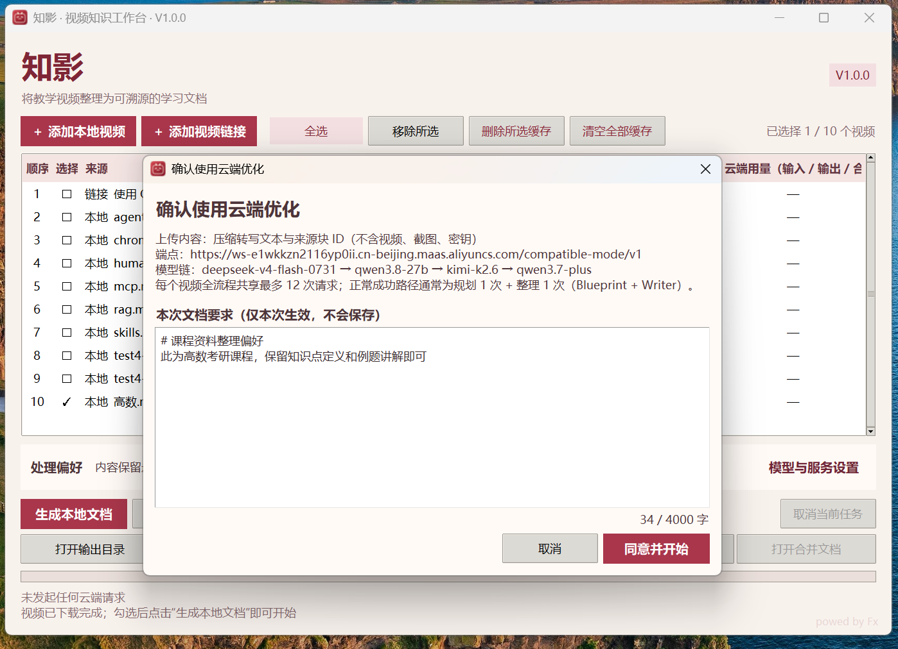

窗口中明确展示：

- **上传内容**：压缩转写与文本为来源 ID（不含视频、截图、密钥）；
- **端点**：本次请求的具体服务地址；
- **模型链**：按顺序回退的模型列表与单视频最大请求次数；
- **本次文档要求**：可以使用默认提示词，也可以用自然语言指定本次偏好，例如"侧重概念解释，少写复习口号"。

> 每次真实云端整理都需要单独确认；图片授权也不能由文本授权隐式获得。

---

## 执行流程

> 以下截图以一段约 **3 小时的高数课程**为例，演示一次完整的本地整理过程。处理过程中可在任务管理器观察到 CPU / GPU / 内存的实时占用。

### 关键画面抽取

首次执行时，先从视频中均匀抽取候选关键画面：

> "正在提取候选画面 · 关键画面 · 6% · 已用 00:06"

### 本地语音识别

调用本地 ASR（faster-whisper / Qwen3-ASR）转写音轨。早期阶段 GPU 进入 3D 高占用：

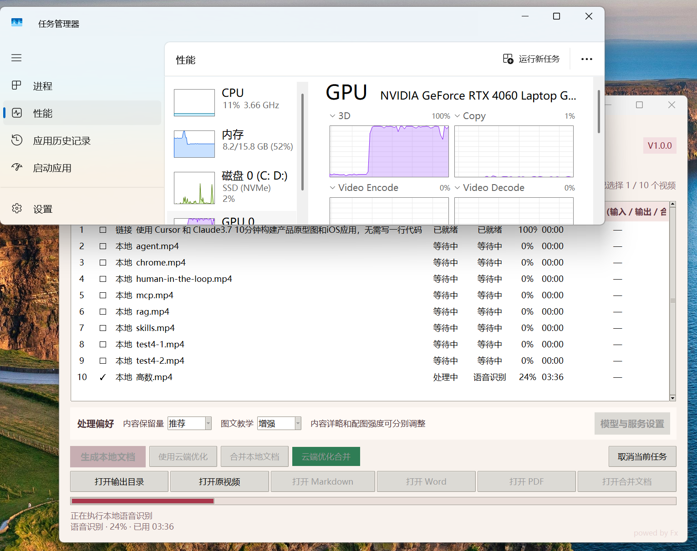

> "正在执行本地语音识别 · 语音识别 · 24% · 已用 03:36"

转写进行中，任务列表显示帧级进度：

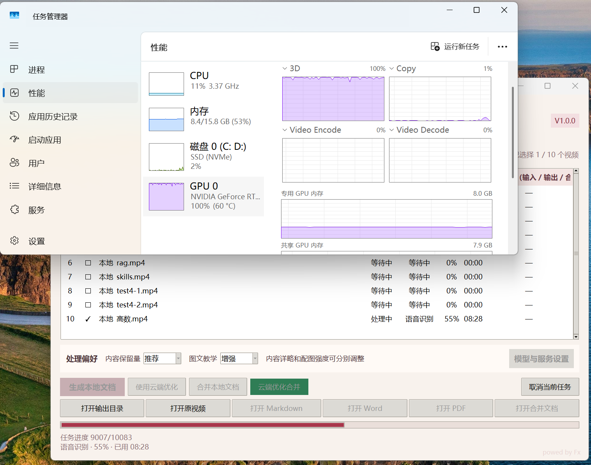

> "任务进度 9007 / 10083 · 语音识别 · 55% · 已用 08:28"

### 知识整理

把转写结果组织成初步的知识点结构，进入知识整理阶段：

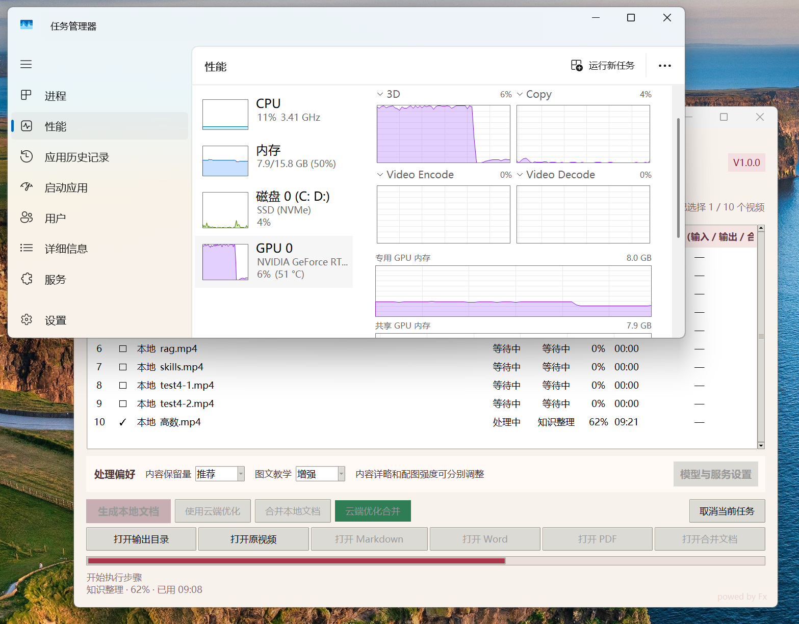

> "开始执行步骤 · 知识整理 · 62% · 已用 09:08"

### 视觉核验（候选帧比较 / 图片选取）

从候选关键帧中比较并挑选出最贴合知识点的画面。本地视觉模型此时 GPU 占用明显抬升：

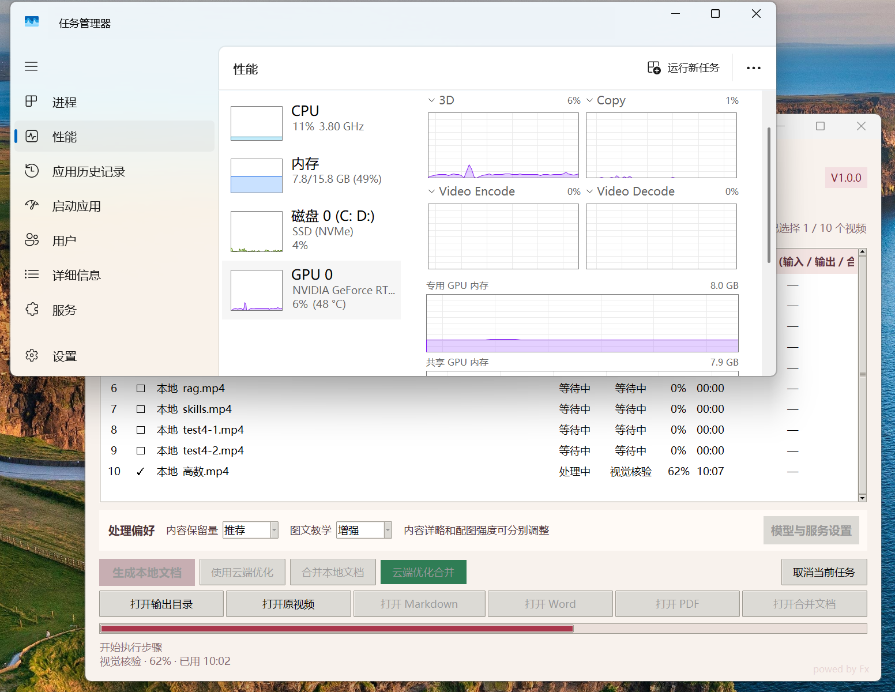

> "开始执行步骤 · 视觉核验 · 62% · 已用 10:02"

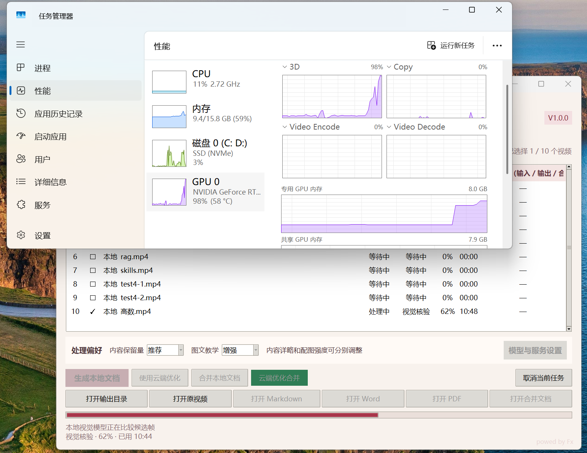

> "本地视觉模型正在比较候选帧 · 视觉核验 · 62% · 已用 10:44"

### 知识点整理

把视觉证据合并回知识点结构，生成更完整的知识图谱：

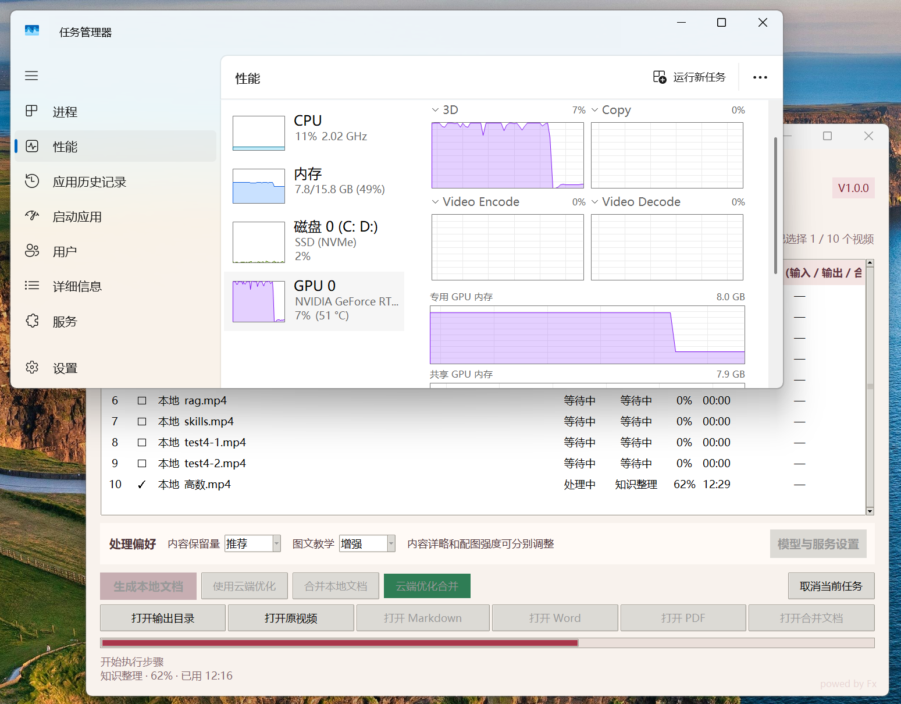

> "开始执行步骤 · 知识整理 · 62% · 已用 12:16"

### 文档组装与生成

把结构化内容渲染成 Markdown、Word 和 PDF：

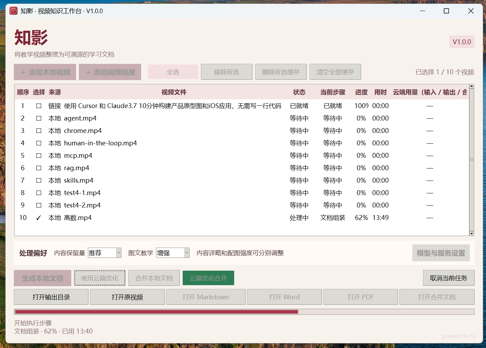

> "开始执行步骤 · 文档组装 · 62% · 已用 13:40"

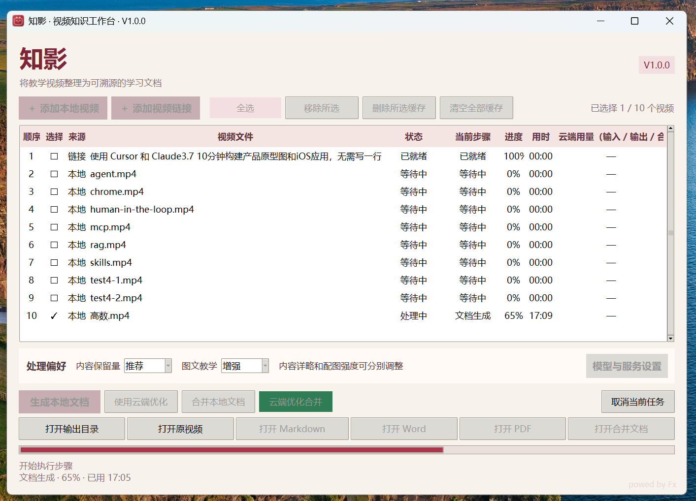

> "开始执行步骤 · 文档生成 · 65% · 已用 17:05"

### 任务完成

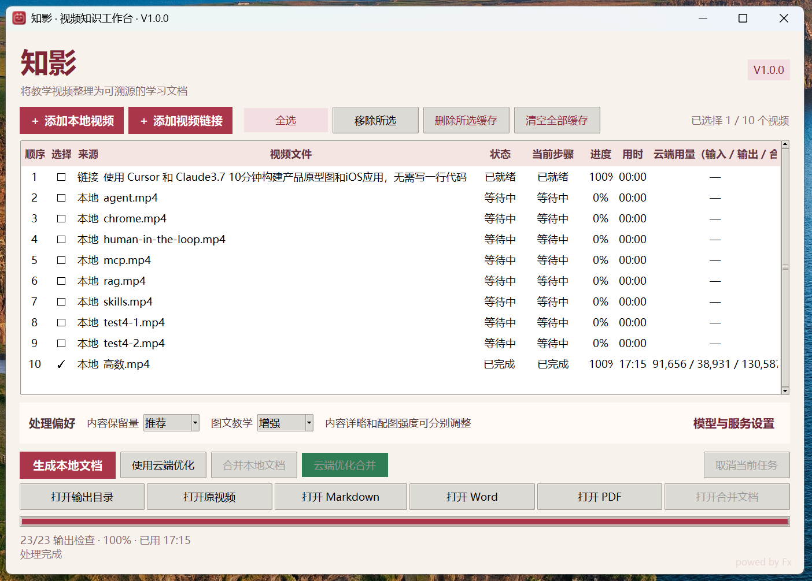

- **状态**：`已完成`
- **用时**：17:15（约 **3 小时视频 → 17 分钟**本地整理）
- **云端用量**：91,656 / 38,931 / 130,587 tokens（输入 / 输出 / 合计 ≈ 13 万）
- **输出检查**：23 / 23 通过

---

## 输出效果

`output/` 目录同时产出三种格式。Word 文档中包含标题、原生公式、关键画面和回看来源链接：

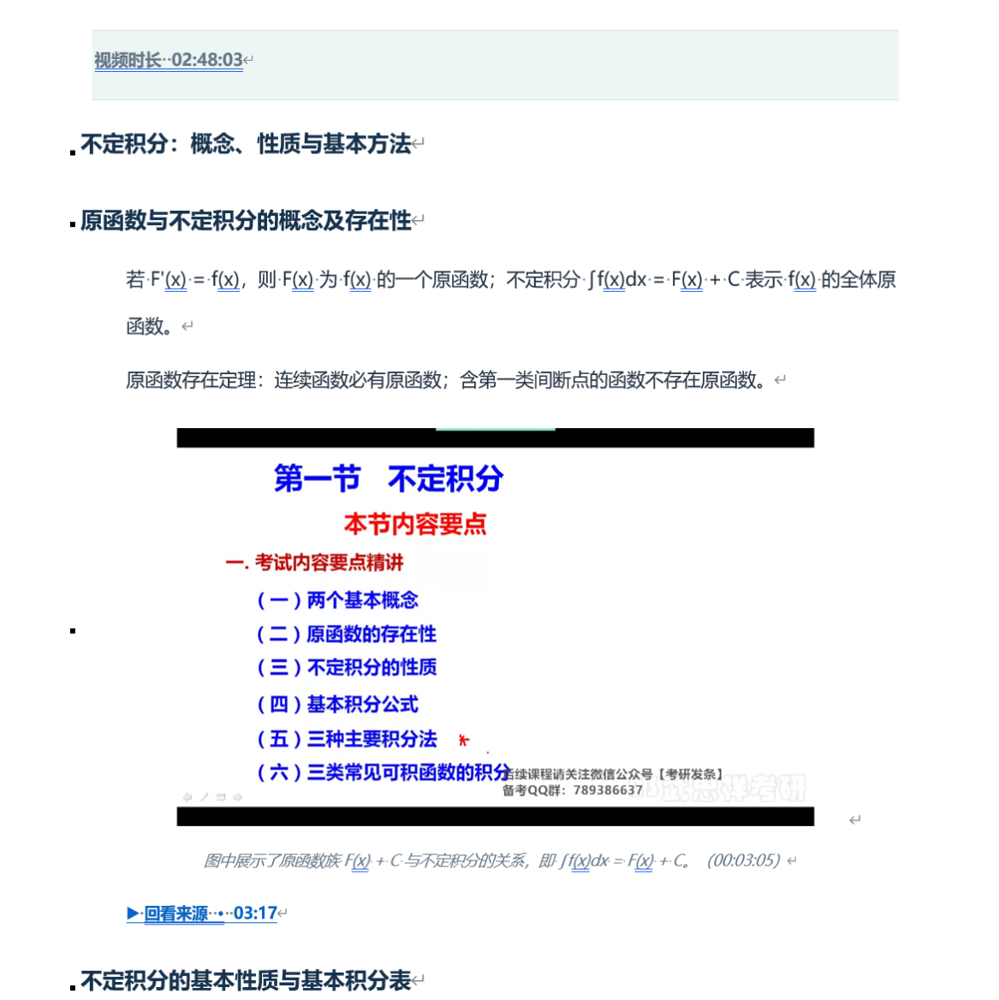

可以看到：

- 视频时长、超链接直接绑定到原视频的对应时间；
- 关键概念（如图中的"原函数"、"不定积分"）配以原视频画面与可点击跳转；
- 每个知识点后附带 `▶ 回看来源 ··· 03:17` 一键跳转链接。

---

## 本地模式 vs 云端模式

| 对比项 | 本地模式 | 云端模式 |
|---|---|---|
| 默认状态 | 可直接使用 | 默认关闭 |
| 网络与费用 | 不需要云端调用 | 消耗云端 Token |
| 发送内容 | 不发送 | 压缩后的文字证据，不含视频、截图、密钥 |
| 内容组织 | 本地确定性策略 | 模型参与结构规划、写作和有限修订 |
| 失败时 | 继续生成本地文档 | 自动退回结构化云端或本地链，标明降级原因 |
| 授权 | 无需 | 每次单独确认 |

无论使用哪种模式，正文都会先整理成统一的内容结构，再从中渲染 Markdown、Word 和 PDF，三种格式共享同一份正文、公式、图片和来源。

---

## 多视频合并

多个视频分别整理完成后，勾选已完成项目，再选择 `合并本地文档` 或 `云端优化合并`。综合文档会按视频组织内容，并保留各自的来源链接。

> 合并不会改变原视频的单独产物。

---

## 回看原视频

文档中的来源使用 `video-study://` 本地协议。点击链接后：

- 调用本地播放器并尽量定位到对应时间；
- 优先使用 `ffplay` 精确定位；没有 `ffplay` 时调用系统默认播放器，可能需要手动拖动进度条；
- 该链接不会打开网页，也不会启动本地 Web 服务。

---

## 常用功能

### 删除缓存

选中视频后点击 `删除所选缓存`：

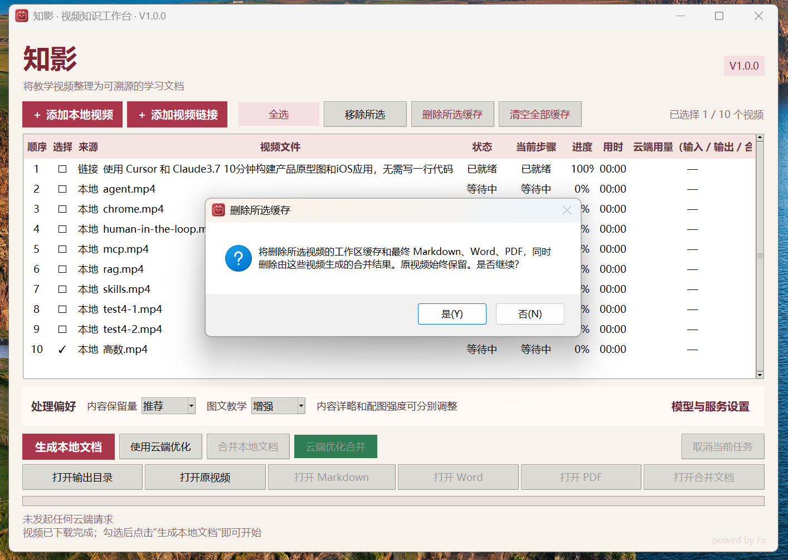

将删除所选视频的：

- 工作区缓存（转写、关键帧、知识结构等中间产物）；
- 最终 Markdown、Word、PDF；
- 由这些视频生成的合并结果。

> 原视频始终保留。

### 取消任务

点击 `取消当前任务`：

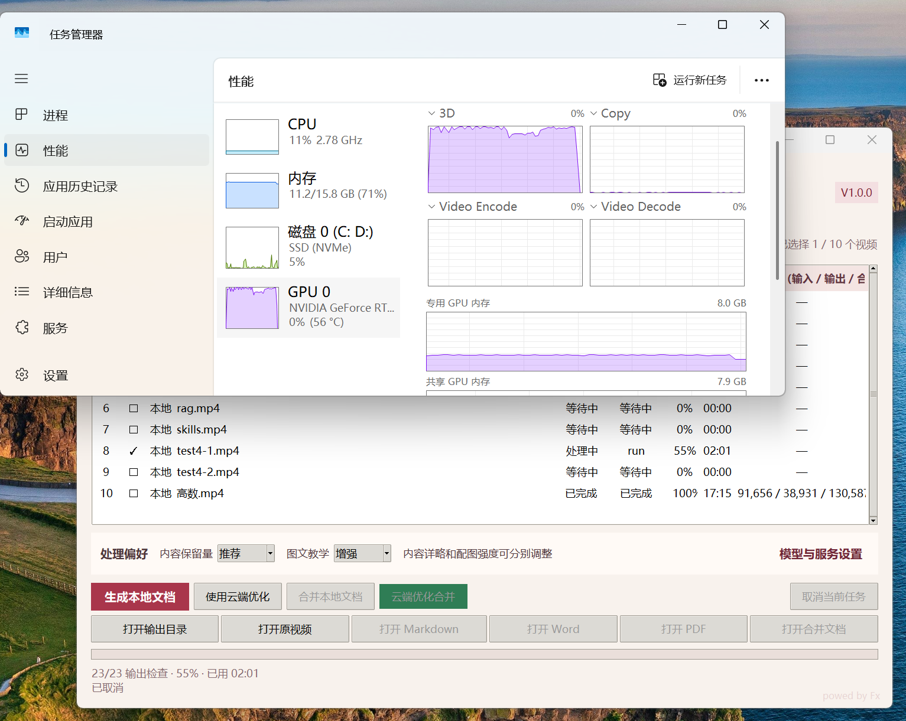

- 毫秒级响应，立即停止运行；
- 已完成并校验通过的中间产物会写入缓存；
- 下次重新加入同一视频时优先复用缓存，从断点继续；
- 源视频不会被删除。

---

## 缓存、取消与文件位置

| 位置 | 内容 | 清理策略 |
|---|---|---|
| `Resource/` | 本地输入视频 | 清理工作区时保留 |
| `视频/` | 链接下载的视频 | 清理工作区时保留 |
| `workspace/` | 转写、关键帧、知识结构等可恢复中间结果 | 可通过界面清理 |
| `output/` | Markdown、Word、PDF | 可重新生成 |
| `models/` | 本地模型 | 不要随意删除或覆盖 |

取消任务只停止当前运行，不会删除源视频。重新加入同一视频时，系统会优先复用已经校验通过的中间结果。

---

## 常见问题

### 清理缓存会删除原视频吗？

不会。`Resource/` 中的本地视频和 `视频/` 中的下载文件始终保留，界面会明确提示将要删除的范围。

### 云端优化会上传视频或截图吗？

不会。当前文本授权只覆盖压缩后的文字证据；视频、截图、密钥一律不上传；图片授权也不能由文本授权隐式获得。

### 为什么文档里某段内容比较简略？

通常是原视频证据不足、转写置信度低或云端能力降级。知影会优先避免把不确定内容写成确定结论，可查看任务的降级状态和来源链接。

### 关闭软件后还能继续吗？

建议先取消当前任务再退出。下次处理同一视频时，已提交并校验通过的步骤会从缓存恢复。

### 为什么链接解析失败？

网站策略、登录要求或网络状态都可能变化。不要把某个站点的历史成功案例理解为永久兼容承诺，以界面当前诊断为准。

---

## 继续阅读

- [业务文档](业务文档.md)：产品定位、用户和业务边界
- [开发文档](开发文档.md)：定位代码、运行测试、提交修改
- [架构详解](架构详解.md)：Graph、缓存、证据和降级机制
- [项目文档导航](README.md)：返回本目录入口
